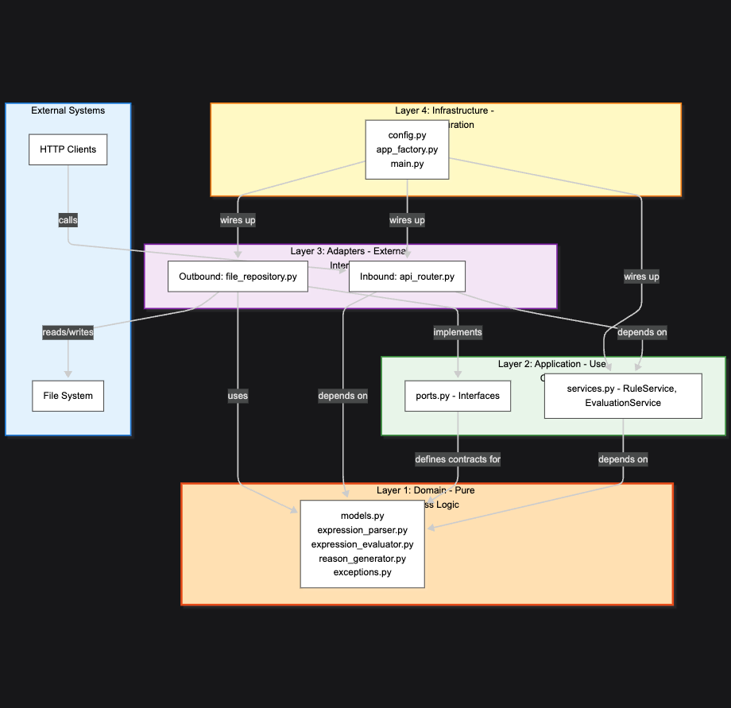

# Rekord Rule Evaluator System - Technical Architecture

## Overview

This document provides detailed technical information about the Rekord Rule Evaluator System's architecture, implementation details, and design decisions. For a high-level overview, see [SYSTEM_SUMMARY.md](../SYSTEM_SUMMARY.md).

---

## Architecture

### Hexagonal Architecture (Ports & Adapters Pattern)

The system follows a ports and adapters architecture to keep separation between business logic (domain & application layer) and technical and infra logic (infrastructure later).

We have two adapters:
- **Inbound Adapter**: The API for managing rules (FastAPI REST endpoints)
- **Outbound Adapter**: File repository that interacts with data stored in `rules.json`

A full technical diagram can be found [here](./dependency_flow.mmd) (you can run this in VS Code with a mermaid extension).

Here is a snapshot:



### Layer Responsibilities

**Domain Layer** (`backend/src/domain/`)
- Core business entities (Rule, Predicate, EvaluationResult)
- Business logic for expression parsing and evaluation
- Domain-specific exceptions
- No dependencies on external frameworks

**Application Layer** (`backend/src/application/`)
- Use case orchestration (RuleService, EvaluationService)
- Port definitions (interfaces like RuleRepository)
- Business rule validation
- Coordinates domain objects to fulfill use cases

**Adapters Layer** (`backend/src/adapters/`)
- **Inbound**: FastAPI HTTP endpoints, request/response models
- **Outbound**: File-based repository implementation
- Translates between external formats and domain models

**Infrastructure Layer** (`backend/src/infrastructure/`)
- Application configuration
- FastAPI app factory
- Dependency injection setup

### Benefits of This Architecture

- **Testability**: Business logic can be tested without external dependencies
- **Flexibility**: Easy to swap implementations (file → database)
- **Maintainability**: Clear separation of concerns
- **Independence**: Domain layer is framework-agnostic

---

## Directory Structure

```
rekord/
├── backend/
│   ├── src/
│   │   ├── domain/                       # Core business logic
│   │   │   ├── models.py                 # Domain entities (Rule, Predicate, etc.)
│   │   │   ├── exceptions.py             # Domain-specific exceptions
│   │   │   ├── expression_parser.py      # Boolean expression parser with AST
│   │   │   ├── expression_evaluator.py   # Expression evaluation engine
│   │   │   └── reason_generator.py       # Smart reason generation
│   │   ├── application/                  # Use cases and business orchestration
│   │   │   ├── ports.py                  # Interface definitions (RuleRepository)
│   │   │   └── services.py               # Business logic (RuleService, EvaluationService)
│   │   ├── adapters/                     # External interfaces
│   │   │   ├── inbound/                  # API endpoints
│   │   │   │   └── api_router.py         # FastAPI routes
│   │   │   └── outbound/                 # External services
│   │   │       └── file_repository.py    # JSON file storage
│   │   ├── infrastructure/               # Configuration and setup
│   │   │   ├── config.py                 # Application config
│   │   │   └── app_factory.py            # FastAPI app factory
│   │   └── main.py                       # Application entry point
│   ├── data/
│   │   └── rules.json                    # Persistent rule storage
│   ├── tests/                            # Unit and integration tests
│   │   ├── test_expression_parser.py
│   │   └── test_expression_evaluator.py
│   ├── requirements.txt                  # Python dependencies
│   ├── requirements-test.txt             # Test dependencies
│   └── Dockerfile                        # Backend container definition
├── frontend/
│   ├── index.html                        # Main UI
│   ├── app.js                            # Frontend logic (435 lines)
│   └── style.css                         # Styling
├── docs/
│   ├── arch.mmd                          # Architecture diagram (Mermaid)
│   ├── dependency_flow.mmd               # Dependency flow diagram
│   ├── dependency_flow.png               # Rendered diagram
│   ├── evaluation_flow.mmd               # Evaluation flow diagram
│   └── README.md                         # Documentation index
├── docker-compose.yml                    # Container orchestration
└── README.md                             # Project documentation
```

### Key Files Explained

**Domain Layer:**
- `models.py`: Defines core entities like Rule, Predicate, EvaluationResult
- `expression_parser.py`: Tokenizer and AST parser for boolean expressions
- `expression_evaluator.py` : Evaluates AST against payloads
- `reason_generator.py`: Generates human-readable explanations
- `exceptions.py`: Domain-specific exceptions (MissingFieldException, etc.)

**Application Layer:**
- `services.py` : RuleService (CRUD) and EvaluationService (evaluation logic)
- `ports.py`: RuleRepository interface definition

**Adapters:**
- `api_router.py`: FastAPI routes with Pydantic models
- `file_repository.py`: JSON file-based persistence with locking

**Infrastructure:**
- `config.py`: Configuration information
- `app_factory.py`: Creates and configures FastAPI application

---

## Rules Format and Evaluation Strategy (Detailed)

### Rule Structure

#### Option 1: Predicate-Based Rules

```json
{
  "name": "Rule Name",
  "description": "Rule description",
  "predicates": [
    {
      "field": "field_name",
      "operator": ">=",
      "value": 18
    },
    {
      "field": "another_field",
      "operator": "in",
      "value": ["option1", "option2"]
    }
  ],
  "logical_operator": "AND"  // or "OR"
}
```

**Evaluation Logic:**

- **AND Logic** (default): ALL predicates must pass for the rule to pass
  - Short-circuit is NOT used - all predicates evaluated for detailed reporting
  - Final result: PASS only if all predicates pass

- **OR Logic**: At least ONE predicate must pass for the rule to pass
  - All predicates are still evaluated (no short-circuit)
  - Final result: PASS if any predicate passes
  - Important: Still shows which predicates failed for transparency

**Why No Short-Circuit?**
In regulated environments, users need to know ALL failing conditions, not just the first one. For example, in a banking KYC check with OR logic (utility bill OR lease), if the user provides neither, they need to know both are missing.

#### Option 2: Expression-Based Rules

```json
{
  "name": "Rule Name",
  "description": "Rule description",
  "expression": "(age >= 18 AND credit_score > 700) OR country == 'USA'"
}
```

**Expression Grammar:**

```
expression     → or_expr
or_expr        → and_expr ( "OR" and_expr )*
and_expr       → comparison ( "AND" comparison )*
comparison     → field operator value
               | field operator field
               | "(" expression ")"

field          → IDENTIFIER
operator       → "==" | "!=" | ">=" | "<=" | ">" | "<"
               | "contains" | "not_contains" | "in" | "not_in"
value          → NUMBER | STRING | BOOLEAN | NULL | ARRAY
```

**Operator Precedence** (highest to lowest):
1. Parentheses `( )`
2. Comparison operators (`==`, `>`, `contains`, etc.)
3. AND operator
4. OR operator

### Detailed Evaluation Flow

```
Expression: (age >= 18 AND credit_score > 700) OR country == 'USA'
Payload: {"age": 25, "credit_score": 650, "country": "Canada"}

Step 1: TOKENIZE
Tokens: [
  (LPAREN, '(', 0),
  (FIELD, 'age', 1),
  (OPERATOR, '>=', 5),
  (VALUE, 18, 8),
  (AND, 'AND', 11),
  (FIELD, 'credit_score', 15),
  (OPERATOR, '>', 28),
  (VALUE, 700, 30),
  (RPAREN, ')', 33),
  (OR, 'OR', 35),
  (FIELD, 'country', 38),
  (OPERATOR, '==', 46),
  (VALUE, 'USA', 49),
  (EOF, None, 54)
]

Step 2: PARSE into AST
         OR
        /  \
      AND   ComparisonNode
     /  \    (country == 'USA')
  Comp  Comp
  (age)  (credit_score)

Step 3: VALIDATE
Check all fields exist in payload: ✓
- age: ✓ (25)
- credit_score: ✓ (650)
- country: ✓ ('Canada')

Step 4: EVALUATE
1. age >= 18: 25 >= 18 → TRUE ✓
2. credit_score > 700: 650 > 700 → FALSE ✗
3. AND: TRUE AND FALSE → FALSE
4. country == 'USA': 'Canada' == 'USA' → FALSE ✗
5. OR: FALSE OR FALSE → FALSE

Step 5: GENERATE REASONS
Predicate Results:
- age >= 18: PASS - "Age (25) meets minimum requirement (18)"
- credit_score > 700: FAIL - "Credit score (650) is below required threshold (700)"
- country == 'USA': FAIL - "Country must be USA"

Final Result: FAIL
Reason: "Credit score (650) is below required threshold (700); Country must be USA"
```

### Expression Parser Implementation

#### Tokenizer (`ExpressionTokenizer`)

**Responsibilities:**
- Convert expression string into tokens
- Recognize operators, field names, literals, parentheses
- Handle string literals with quotes and escapes
- Parse numbers (int and float)
- Parse arrays `[1, 2, 3]`
- Parse booleans and null (case-insensitive)

**Special Features:**
- Detects common errors (single `=` instead of `==`)
- Word boundary detection (ensures `contains` in field name doesn't trigger operator)
- Provides context in error messages (shows surrounding characters)

**Example Tokenization:**
```python
expression = "age >= 18 AND status in ['active', 'pending']"

# Produces tokens:
[
  Token(FIELD, 'age', 0),
  Token(OPERATOR, '>=', 4),
  Token(VALUE, 18, 7),
  Token(AND, 'AND', 10),
  Token(FIELD, 'status', 14),
  Token(OPERATOR, 'in', 21),
  Token(VALUE, ['active', 'pending'], 24),
  Token(EOF, None, 44)
]
```

#### Parser (`ExpressionParser`)

**Responsibilities:**
- Build Abstract Syntax Tree (AST) from tokens
- Implement operator precedence
- Validate syntax structure
- Create comparison and binary operation nodes

**AST Node Types:**

1. **ComparisonNode**
   ```python
   @dataclass
   class ComparisonNode:
       field: str                    # Left-hand field name
       operator: str                 # Comparison operator
       value: Any                    # Right-hand value or field name
       is_field_comparison: bool     # True if comparing two fields
   ```

2. **BinaryOpNode**
   ```python
   @dataclass
   class BinaryOpNode:
       operator: str                 # "AND" or "OR"
       left: Node                    # Left subtree
       right: Node                   # Right subtree
   ```

#### Evaluator (`ExpressionEvaluator`)

**Responsibilities:**
- Recursively evaluate AST against payload
- Perform comparison operations
- Handle type checking and conversions
- Track detailed results for each comparison

**Evaluation Algorithm:**

```python
def evaluate(node: Node) -> bool:
    if isinstance(node, ComparisonNode):
        return evaluate_comparison(node)
    elif isinstance(node, BinaryOpNode):
        left_result = evaluate(node.left)
        right_result = evaluate(node.right)

        if node.operator == "AND":
            return left_result and right_result
        elif node.operator == "OR":
            return left_result or right_result

def evaluate_comparison(node: ComparisonNode) -> bool:
    actual_value = payload[node.field]

    if node.is_field_comparison:
        expected_value = payload[node.value]  # Field-to-field
    else:
        expected_value = node.value           # Literal value

    # Apply operator
    if node.operator == "==":
        return actual_value == expected_value
    elif node.operator == ">=":
        return actual_value >= expected_value
    # ... etc for all operators
```

**DetailedExpressionEvaluator:**

Extends the base evaluator to track results for each comparison:

```python
class DetailedExpressionEvaluator(ExpressionEvaluator):
    def __init__(self, payload):
        super().__init__(payload)
        self.comparison_results = []

    def evaluate_comparison(self, node):
        result = super().evaluate_comparison(node)

        self.comparison_results.append({
            "field": node.field,
            "operator": node.operator,
            "expected": expected_value,
            "actual": actual_value,
            "passed": result,
            "reason": generate_reason(...)
        })

        return result
```

### Field-to-Field Comparisons

The system supports comparing payload fields to each other:

```json
{
  "expression": "ip_country == account_country"
}
```

**How it works:**
1. Tokenizer identifies both as FIELD tokens
2. Parser creates ComparisonNode with `is_field_comparison=True`
3. Evaluator looks up both values from payload
4. Performs comparison between the two payload values

**Example:**
```python
expression = "password == confirm_password"

# Payload
{
  "password": "apple123",
  "confirm_password": "apple123"
}

# Evaluation
password_value = payload["password"]  # "apple123"
confirm_password_value = payload["confirm_password"]      # "apple123"
result = "apple123" == "apple123"     # True
```

---

## Local Development

### Prerequisites
- Python 3.11 or higher
- pip (Python package manager)
- Virtual environment (recommended)

### Backend Setup

```bash
# Navigate to backend directory
cd backend

# Create virtual environment
python -m venv venv

# Activate virtual environment
# On macOS/Linux:
source venv/bin/activate
# On Windows:
venv\Scripts\activate

# Install dependencies
pip install -r requirements.txt

# Install test dependencies (optional)
pip install -r requirements-test.txt

# Start the backend server
cd src
python main.py
```

The backend will be available at:
- **API**: http://localhost:8000
- **Swagger Docs**: http://localhost:8000/docs
- **Health Check**: http://localhost:8000/health

### Frontend Setup

```bash
# From project root
cd frontend

# Serve with Python's built-in server
python -m http.server 8080

# Or use any other static file server
```

Frontend will be available at: http://localhost:8080


### Running Tests

```bash
# From backend directory
cd backend

# Run all tests
pytest tests/ -v

# Run specific test file
pytest tests/test_expression_parser.py -v

# Run with coverage
pytest tests/ --cov=src --cov-report=html
```

